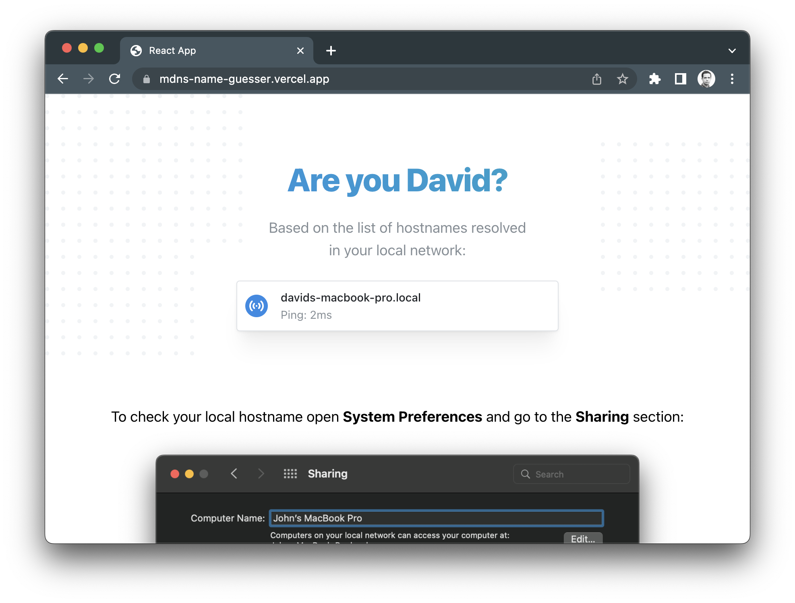

# MacOS Real Name Brute Forcing

This is the demo source code for the [article](https://fingerprint.com/blog/apple-macos-mdns-brute-force/).

⚠️ The demo works only for devices running MacOS, such as Macbook or iMac

The name brute-forcing technique uses a pre-made list of the 50 most popular gender-specific names from a specific country origin.

It's important to mention that the proof of concept demo is simply a demonstration of the attack and may not be successful in some cases. Some of the factors that could impact the results are:

- The presence of rare or unique names or non-standard macOS hostnames
- Particular network configurations or VPN networks
- Enabled firewall in macOS network settings

If the demo does not work for you, consider using the advanced configuration settings to verify the list of the probed names and the device name pattern applied. If you use a VPN, consider testing it with and without VPN, because the result may change.
